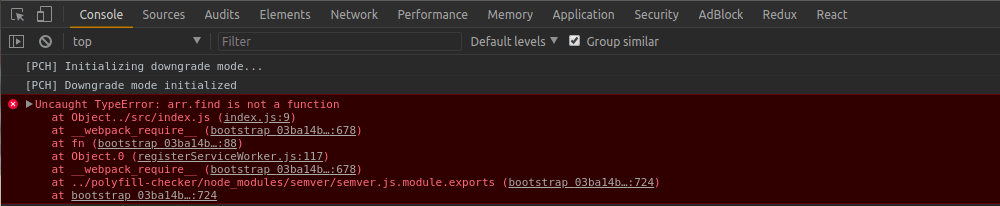
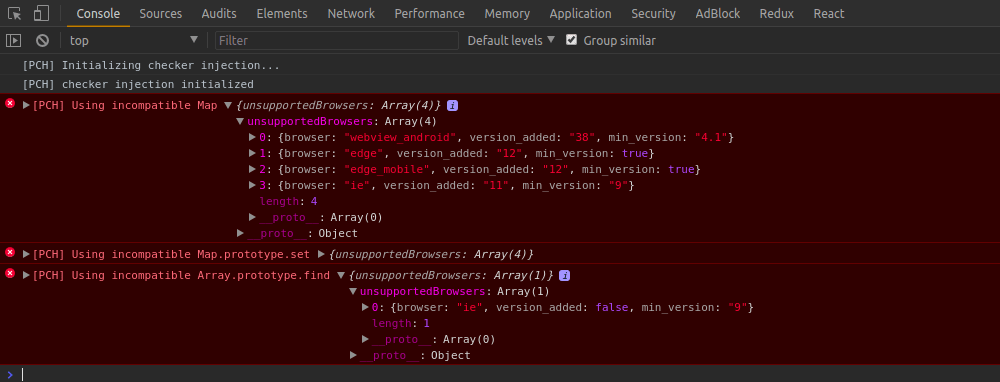

# Polyfill checker

Cross browser built-in functions/objects compatibility checker.




## Installation

```bash
npm install polyfill-checker
```

## Usage

Import and initialize polyfill checker before your application runs:

```js
if (process.env.NODE_ENV !== 'production') {
  const { PolyfillChecker } = require('polyfill-checker')
  const checker = new PolyfillChecker({
    minBrowsers: {
      ie: '9',
      safari: '10',
      chrome_android: '60',
    }
  })
  checker.downgradeMode()
  // checker.injectChecker()
}
```

It uses [browser-compat-data](https://github.com/mdn/browser-compat-data) to check browser compatibility.

You can find more in [example project](./example)

## Api

### Constructor

`PolyfillChecker` constructor takes one optional config parameter, see [defaultConfig](./polyfill-checker/src/defaultConfig.js).

### downgradeMode()

Removes not compatible built-ins (according to `minBrowsers`) from the browser.
Your code will fail everytime you use such built-in without appropriate polyfill.

### injectChecker()

Injects checker interceptors to the not compatible built-ins (according to `minBrowsers`) and warns you in the console when using it.

**Note:** Many 3rd party libraries use new built-ins if available (e.g. React uses Symbol, etc.) and frameworks may also use unsupported features in dev mode (e.g. during hot reload).
You can either ignore related errors or exclude such built-ins from checker (`exclude` config).
Be carefull when using exclude config and include appropriate polyfill or don't use the feature in production code.

**Note:** Using both `injectChecker` and `downgradeMode` doesn't make sense. You should use only one of them.

## Integration

3rd party libraries and frameworks often includes some polyfills into your application.
We provide presets to exclude those polyfilled built-ins from the checker:

```js
const {
  PolyfillChecker,
  createReactAppPreset, // create-react-app
} = require('polyfill-checker')

const checker = new PolyfillChecker({
  exclude: [createReactAppPreset]
})
```

## Contributing

Contributions are welcome! Just open an issues with any idea or pull-request if it is no-brainer. Make sure all tests and linting rules pass.
